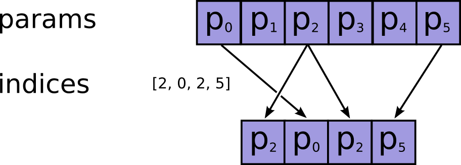
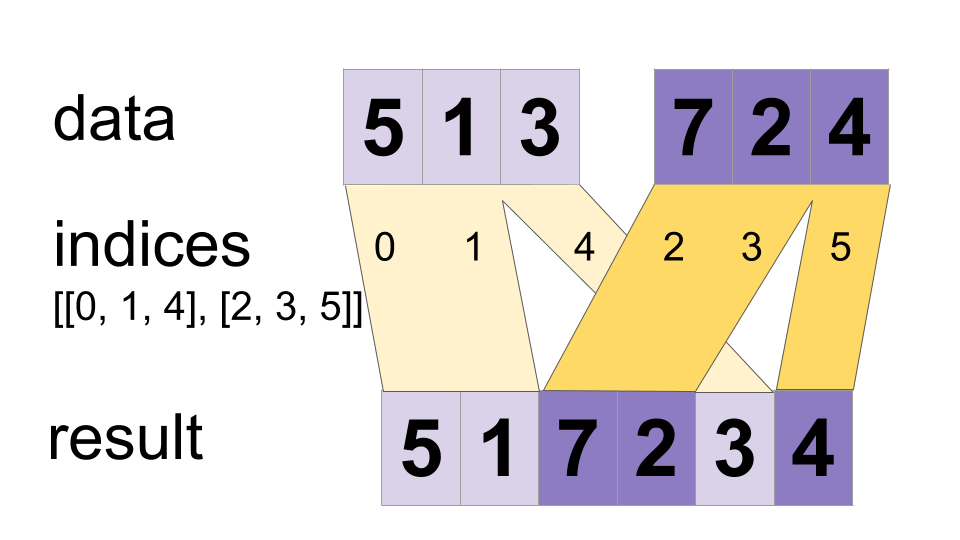

<!-- This file is machine generated: DO NOT EDIT! -->

# 텐서 변환

참고: `Tensor`를 인자로 받는 함수들은, [`tf.convert_to_tensor`](framework.md#convert_to_tensor)의 인자가 될 수 있는 것들 또한 인자로 받을 수 있습니다.

<!--[TOC]는 gitbook에서 보이지 않아 주석 처리합니다.-->

## 형변환 (Casting)

TensorFlow는 그래프에 사용되는 텐서 자료형들을 형변환(cast)할 수 있는 몇 가지 함수를 제공합니다.

- - -

### `tf.string_to_number(string_tensor, out_type=None, name=None)` {#string_to_number}

입력 텐서의 각 문자열(string)을 지정된 자료형의 값으로 변환합니다.

(참고로, int32 오버플로우는 에러를 내며, float 오버플로우는 반올림한 결과를 냅니다.)

##### 인자:

*  <b>`string_tensor`</b>: `string`형 `Tensor`.
*  <b>`out_type`</b>: `tf.DType` 오브젝트. `tf.float32` 또는 `tf.int32`이어야 하며, 기본값은 `tf.float32`입니다. 이 자료형으로 `string_tensor`의 문자열이 변환됩니다. (선택사항)
*  <b>`name`</b>: 오퍼레이션의 명칭. (선택사항)

##### 반환값:

  `out_type`형의 `Tensor`.
  출력 텐서는 입력 텐서 `string_tensor`와 같은 구조(shape)를 가집니다.


- - -

### `tf.to_double(x, name='ToDouble')` {#to_double}

텐서를 `float64`형으로 변환합니다.

##### 인자:


*  <b>`x`</b>: `Tensor` 또는 `SparseTensor`.
*  <b>`name`</b>: 오퍼레이션의 명칭. (선택사항)

##### 반환값:

  `x`와 구조(shape)가 같은 `float64`형의 `Tensor` 또는 `SparseTensor`.

##### 예외:


*  <b>`TypeError`</b>: `x`가 `float64`형으로 변환될 수 없는 경우.


- - -

### `tf.to_float(x, name='ToFloat')` {#to_float}

텐서를 `float32`형으로 변환합니다.

##### 인자:


*  <b>`x`</b>: `Tensor` 또는 `SparseTensor`.
*  <b>`name`</b>: 오퍼레이션의 명칭. (선택사항)

##### 반환값:

  `x`와 구조(shape)가 같은 `float32`형의 `Tensor` 또는 `SparseTensor`.

##### 예외:


*  <b>`TypeError`</b>: `x`가 `float32`형으로 변환될 수 없는 경우.


- - -

### `tf.to_bfloat16(x, name='ToBFloat16')` {#to_bfloat16}

텐서를 `bfloat16`형으로 변환합니다.

##### 인자:


*  <b>`x`</b>: `Tensor` 또는 `SparseTensor`.
*  <b>`name`</b>: 오퍼레이션의 명칭. (선택사항)

##### 반환값:

  `x`와 구조(shape)가 같은 `bfloat16`형의 `Tensor` 또는 `SparseTensor`.

##### 예외:


*  <b>`TypeError`</b>: `x`가 `bfloat16`형으로 변환될 수 없는 경우.


- - -

### `tf.to_int32(x, name='ToInt32')` {#to_int32}

텐서를 `int32`형으로 변환합니다.

##### 인자:


*  <b>`x`</b>: `Tensor` 또는 `SparseTensor`.
*  <b>`name`</b>: 오퍼레이션의 명칭. (선택사항)

##### 반환값:

  `x`와 구조(shape)가 같은 `int32`형의 `Tensor` 또는 `SparseTensor`.

##### 예외:


*  <b>`TypeError`</b>: `x`가 `int32`형으로 변환될 수 없는 경우.


- - -

### `tf.to_int64(x, name='ToInt64')` {#to_int64}

텐서를 `int64`형으로 변환합니다.

##### 인자:


*  <b>`x`</b>: `Tensor` 또는 `SparseTensor`.
*  <b>`name`</b>: 오퍼레이션의 명칭. (선택사항)

##### 반환값:

  `x`와 구조(shape)가 같은 `int64`형의 `Tensor` 또는 `SparseTensor`.

##### 예외:


*  <b>`TypeError`</b>: `x`가 `int64`형으로 변환될 수 없는 경우.


- - -

### `tf.cast(x, dtype, name=None)` {#cast}

텐서를 새로운 자료형으로 변환합니다.

`x`(`Tensor`의 경우) 또는 `x.values`(`SparseTensor`의 경우)를 `dtype`형으로 변환합니다.

예시:

```python
# 텐서 `a`는 [1.8, 2.2], 자료형은 tf.float
tf.cast(a, tf.int32) ==> [1, 2]  # dtype=tf.int32
```

##### 인자:


*  <b>`x`</b>: `Tensor` 또는 `SparseTensor`.
*  <b>`dtype`</b>: 변환될 자료형.
*  <b>`name`</b>: 오퍼레이션의 명칭. (선택사항)

##### 반환값:

  `x`와 구조(shape)가 같은 `int64`형의 `Tensor` 또는 `SparseTensor`.

##### 예외:


*  <b>`TypeError`</b>: `x`가 `dtype`형으로 변환될 수 없는 경우.


- - -

### `tf.saturate_cast(value, dtype, name=None)` {#saturate_cast}

`value`를 `dtype` 형으로 안전하게 포화 형변환(saturating cast)합니다.

이 함수는 입력을 `dtype`으로 스케일링(scaling) 없이 변환합니다. 형변환 시 오버플로우나 언더플로우가 발생할 수 있는 값들에 대해, 이 함수는 해당 값들을 허용되는 값 범위로 넣은 뒤 형변환을 진행합니다.

##### 인자:


*  <b>`value`</b>: `Tensor`.
*  <b>`dtype`</b>: `DType` 오브젝트. 변환될 자료형.
*  <b>`name`</b>: 오퍼레이션의 명칭. (선택사항)

##### 반환값:

  `dtype`형으로 안전하게 변환된 `value`.


## 구조(Shape) 및 구조 변형(Shaping)

TensorFlow는 텐서의 구조(shape)를 확인하거나 구조를 변형하는 데 사용할 수 있는 몇 가지 함수를 제공합니다.

- - -

### `tf.shape(input, name=None)` {#shape}

텐서의 구조(shape)를 반환합니다.

이 함수는 `input` 텐서의 구조(shape)를 1-D 정수형 텐서로 반환합니다.

예시:

```python
# 't'는 [[[1, 1, 1], [2, 2, 2]], [[3, 3, 3], [4, 4, 4]]]
shape(t) ==> [2, 2, 3]
```

##### 인자:


*  <b>`input`</b>: `Tensor`.
*  <b>`name`</b>: 오퍼레이션의 명칭. (선택사항)

##### 반환값:

  `int32`형 `Tensor`.


- - -

### `tf.size(input, name=None)` {#size}

텐서의 크기(size)를 반환합니다.

이 함수는 `input` 텐서의 원소의 수를 정수로 반환합니다.

예시:

```python
# 't'는 [[[1, 1, 1], [2, 2, 2]], [[3, 3, 3], [4, 4, 4]]]]
size(t) ==> 12
```

##### 인자:


*  <b>`input`</b>: `Tensor`.
*  <b>`name`</b>: 오퍼레이션의 명칭. (선택사항)

##### 반환값:

  `int32`형 `Tensor`.


- - -

### `tf.rank(input, name=None)` {#rank}

텐서의 랭크(rank)를 반환합니다.

이 함수는 `input` 텐서의 랭크를 정수로 반환합니다.

예시:

```python
# 't' is [[[1, 1, 1], [2, 2, 2]], [[3, 3, 3], [4, 4, 4]]]
# shape of tensor 't' is [2, 2, 3]
rank(t) ==> 3
```

**참고**: 텐서의 랭크는 행렬의 랭크와는 다른 개념입니다. 텐서의 랭크는 텐서의 각 원소를 선택하기 위해 필요한 인덱스의 수입니다. 랭크는 order, degree, ndims 등으로 부르기도 합니다.

##### 인자:


*  <b>`input`</b>: `Tensor` 또는 `SparseTensor`.
*  <b>`name`</b>: 오퍼레이션의 명칭. (선택사항)

##### 반환값:

  `int32`형 `Tensor`.


- - -

### `tf.reshape(tensor, shape, name=None)` {#reshape}

텐서의 구조를 변형합니다.

`tensor`가 주어졌을 때, 이 함수는 해당 텐서와 같은 원소들을 가지며 구조가 `shape`인 텐서를 반환합니다.

만약 `shape`의 한 원소가 -1이라면, 전체 크기가 일정하게 유지되도록 해당 차원의 길이가 자동으로 계산됩니다. 특별히, `shape`가 `[-1]`이라면, 텐서는 1-D로 펴지게 됩니다. `shape`에서 최대 한 개의 원소만 -1이 될 수 있습니다.

만약 `shape`가 1-D이거나 그 이상이라면, 오퍼레이션은 `tensor`의 원소로 `shape`의 구조가 채워진 텐서를 반환합니다. 이 경우, `shape`에 의해 지정된 원소의 전체 수는 `tensor`의 원소의 전체 수와 동일해야 합니다.

예시:

```python
# tensor 't'는 [1, 2, 3, 4, 5, 6, 7, 8, 9]
# tensor 't'의 구조(shape)는 [9]
reshape(t, [3, 3]) ==> [[1, 2, 3],
                        [4, 5, 6],
                        [7, 8, 9]]

# tensor 't'는 [[[1, 1], [2, 2]],
#               [[3, 3], [4, 4]]]
# tensor 't'의 구조(shape)는 [2, 2, 2]
reshape(t, [2, 4]) ==> [[1, 1, 2, 2],
                        [3, 3, 4, 4]]

# tensor 't'는 [[[1, 1, 1],
#                [2, 2, 2]],
#               [[3, 3, 3],
#                [4, 4, 4]],
#               [[5, 5, 5],
#                [6, 6, 6]]]
# tensor 't'의 구조(shape)는 [3, 2, 3]
# shape를 '[-1]'로 하여 't'를 1-D로 펴기
reshape(t, [-1]) ==> [1, 1, 1, 2, 2, 2, 3, 3, 3, 4, 4, 4, 5, 5, 5, 6, 6, 6]

# 구조를 암시(infer)하기 위한 -1의 사용

# -1은 9를 의미:
reshape(t, [2, -1]) ==> [[1, 1, 1, 2, 2, 2, 3, 3, 3],
                         [4, 4, 4, 5, 5, 5, 6, 6, 6]]
# -1은 2를 의미:
reshape(t, [-1, 9]) ==> [[1, 1, 1, 2, 2, 2, 3, 3, 3],
                         [4, 4, 4, 5, 5, 5, 6, 6, 6]]
# -1은 3을 의미:
reshape(t, [ 2, -1, 3]) ==> [[[1, 1, 1],
                              [2, 2, 2],
                              [3, 3, 3]],
                             [[4, 4, 4],
                              [5, 5, 5],
                              [6, 6, 6]]]

# tensor 't'는 [7]
# shape를 `[]`로 하면 스칼라(scalar)로 구조 변환
reshape(t, []) ==> 7
```

##### 인자:


*  <b>`tensor`</b>: `Tensor`.
*  <b>`shape`</b>: `int32`형 `Tensor`. 출력 텐서의 구조(shape) 지정.
*  <b>`name`</b>: 오퍼레이션의 명칭. (선택사항)

##### 반환값:

  `tensor`와 같은 자료형의 `Tensor`.


- - -

### `tf.squeeze(input, squeeze_dims=None, name=None)` {#squeeze}

텐서에서 크기 1인 차원을 제거합니다.

`input` 텐서가 주어졌을 때, 이 함수는 그와 같은 자료형의 크기 1인 차원이 모두 제거된 텐서를 반환합니다. 만약 모든 크기 1인 차원을 제거하고 싶은 것이 아니라면, 제거하고 싶은 특정한 크기 1인 차원들을 `squeeze_dims`으로 지정할 수 있습니다.

예시:

```python
# 't'는 구조(shape) [1, 2, 1, 3, 1, 1]의 텐서
shape(squeeze(t)) ==> [2, 3]
```

제거할 크기 1인 차원들을 `squeeze_dims`으로 지정하기:

```python
# 't'는 구조(shape) [1, 2, 1, 3, 1, 1]의 텐서
shape(squeeze(t, [2, 4])) ==> [1, 2, 3, 1]
```

##### 인자:


*  <b>`input`</b>: `Tensor`.
*  <b>`squeeze_dims`</b>: `int`의 리스트. 기본값은 `[]`. 지정된 경우, 리스트 안의 차원만 제거합니다. 크기가 1이 아닌 차원을 제거하는 것은 오류입니다. (선택사항)
*  <b>`name`</b>: 오퍼레이션의 명칭. (선택사항)

##### 반환값:

  `input`과 같은 자료형의 `Tensor`.
  `input`과 같은 원소를 포함하지만, 하나 이상의 크기 1인 차원이 제거되어 있습니다.


- - -

### `tf.expand_dims(input, dim, name=None)` {#expand_dims}

크기 1인 차원을 텐서의 구조(shape)에 삽입합니다.

`input` 텐서가 주어졌을 때, 이 함수는 크기가 1인 차원을 `input`의 구조에서 차원 인덱스 `dim`에 삽입합니다. 차원 인덱스 `dim`은 0부터 시작합니다. 만약 `dim`에 음수가 지정된다면, 끝에서부터 역으로 계산됩니다.

이 함수는 단일 원소에 배치 차원(batch dimension)을 추가할 때 유용합니다. 예로, 만약 구조 `[height, width, channels]`의 단일 이미지가 있는 경우, 이것에 `expand_dims(image, 0)`을 적용해 구조 `[1, height, width, channels]`인 하나의 이미지로 구성된 배치(batch)를 구성할 수 있습니다.

다른 예시들:

```python
# 't'는 구조(shape) [2]의 텐서
shape(expand_dims(t, 0)) ==> [1, 2]
shape(expand_dims(t, 1)) ==> [2, 1]
shape(expand_dims(t, -1)) ==> [2, 1]

# 't2'는 구조(shape) [2, 3, 5]의 텐서
shape(expand_dims(t2, 0)) ==> [1, 2, 3, 5]
shape(expand_dims(t2, 2)) ==> [2, 3, 1, 5]
shape(expand_dims(t2, 3)) ==> [2, 3, 5, 1]
```

이 함수는 다음의 조건이 만족되어야 합니다:

`-1-input.dims() <= dim <= input.dims()`

이 함수는 크기 1인 차원을 제거하는 함수인 `squeeze()`와 연관되어 있습니다.

##### 인자:


*  <b>`input`</b>: `Tensor`.
*  <b>`dim`</b>: `int32`형 `Tensor`. 0-D (스칼라). `input`의 구조에서 어떤 차원 인덱스에 삽입할 것인지 지정합니다.
*  <b>`name`</b>: 오퍼레이션의 명칭. (선택사항)

##### 반환값:

  `input`과 같은 자료형의 `Tensor`.
  `input`과 같은 원소를 포함하지만, 하나 이상의 크기 1인 차원이 추가되어 있습니다.


## 자르고 붙이기

TensorFlow는 텐서를 자르고 특정 부분을 추출해내거나, 여러 텐서를 붙일 수 있는 몇 가지 함수를 제공합니다.

- - -

### `tf.slice(input_, begin, size, name=None)` {#slice}

텐서의 특정 부분을 추출합니다.

이 함수는 텐서 `input`에서 `begin` 위치에서 시작해 크기 `size`인 부분을 추출합니다. 추출할 부분의 `size`는 텐서 구조(shape)로 표현되는데, `size[i]`가 `input`에서 추출할 `i`번째 차원의 원소의 수입니다. 추출 부분의 시작 위치 `begin`은 각 차원에서의 오프셋(offset)으로 표현됩니다. 즉, `begin[i]`는 `input`의 `i`번째 차원에서 시작 위치의 오프셋입니다.

`begin`은 0부터 시작하고, `size`는 1부터 시작합니다. 만약 `size[i]`가 -1이라면, 차원 `i`의 모든 남은 원소들이 추출 부분에 포함됩니다. 즉, 이는 아래와 같이 설정하는 것과 동일합니다.

`size[i] = input.dim_size(i) - begin[i]`

이 함수는 다음의 조건이 만족되어야 합니다:

`0 <= begin[i] <= begin[i] + size[i] <= Di  for i in [0, n]`

예시:

```python
# 'input'은 [[[1, 1, 1], [2, 2, 2]],
#            [[3, 3, 3], [4, 4, 4]],
#            [[5, 5, 5], [6, 6, 6]]]
tf.slice(input, [1, 0, 0], [1, 1, 3]) ==> [[[3, 3, 3]]]
tf.slice(input, [1, 0, 0], [1, 2, 3]) ==> [[[3, 3, 3],
                                            [4, 4, 4]]]
tf.slice(input, [1, 0, 0], [2, 1, 3]) ==> [[[3, 3, 3]],
                                           [[5, 5, 5]]]
```

##### 인자:


*  <b>`input_`</b>: `Tensor`.
*  <b>`begin`</b>: `int32` 또는 `int64`형 `Tensor`.
*  <b>`size`</b>: `int32` 또는 `int64`형 `Tensor`.
*  <b>`name`</b>: 오퍼레이션의 명칭. (선택사항)

##### 반환값:

  `input`과 같은 자료형의 `Tensor`.


- - -

### `tf.split(split_dim, num_split, value, name='split')` {#split}

한 차원을 따라서 입력된 텐서를 `num_split`개의 텐서로 분리합니다.

`split_dim` 차원을 따라서 `value`를 `num_split` 개의 작은 텐서로 분리합니다. `num_split`이 `value.shape[split_dim]`을 나눌 수 있어야 합니다.

예시:

```python
# 'value'는 구조(shape) [5, 30]의 텐서
# 'value'를 차원 1을 따라 3개의 텐서로 분리
split0, split1, split2 = tf.split(1, 3, value)
tf.shape(split0) ==> [5, 10]
```

##### 인자:


*  <b>`split_dim`</b>: 0-D `int32` `Tensor`. 텐서를 분리할 차원. `[0, rank(value))` 범위 내에 있어야 합니다.
*  <b>`num_split`</b>: Python 정수. 텐서를 분리할 개수.
*  <b>`value`</b>: 분리할 `Tensor`.
*  <b>`name`</b>: 오퍼레이션의 명칭. (선택사항)

##### 반환값:

  `value`를 분리하여 얻어진 `num_split`개의 `Tensor`.


- - -

### `tf.tile(input, multiples, name=None)` {#tile}

주어진 텐서를 타일링(tiling)하여 새로운 텐서를 만듭니다.

이 함수는 주어진 텐서 `input`을 `multiples`회 복사하여 새로운 텐서를 만듭니다. 출력 텐서의 `i`번째 차원은 `input.dims(i) * multiples[i]` 개의 원소를 가지고, 이는 `input`의 원소들이 `multiples[i]`번 복사된 것에 해당합니다. 예로, `[a b c d]`를 `[2]`로 타일링하면 `[a b c d a b c d]`를 얻습니다.

##### 인자:


*  <b>`input`</b>: 1-D 혹은 그 이상의 `Tensor`.
*  <b>`multiples`</b>: `int32`형 `Tensor`. 1-D. 길이는 `input`의 차원의 수와 같아야 합니다.
*  <b>`name`</b>: 오퍼레이션의 명칭. (선택사항)

##### 반환값:

  `input`과 같은 자료형의 `Tensor`.


- - -

### `tf.pad(tensor, paddings, mode='CONSTANT', name=None)` {#pad}

텐서에 패딩을 적용합니다.

이 함수는 지정한 `paddings`에 따라 `tensor`에 패딩을 적용합니다. `padding`은 구조(shape)가 `[n, 2]`인 정수형 텐서이고, 여기서 `n`은 `tensor`의 랭크(rank)입니다. `input`의 각각의 차원 `D`에 대해, `paddings[D, 0]`은 `tensor`의 원소 앞에 몇 개의 값을 넣을 것인지, `paddings[D, 1]`은 `tensor`의 원소 뒤에 몇 개의 값을 넣을 것인지를 나타냅니다. 만약 `mode`가 "REFLECT"라면, `paddings[D, 0]`과 `paddings[D, 1]` 모두 `tensor.dim_size(D) - 1`보다 크지 않아야 합니다. `mode`가 "SYMMETRIC"이라면, `paddings[D, 0]`과 `paddings[D, 1]` 모두 `tensor.dim_size(D)`보다 크지 않아야 합니다.

패딩이 이루어진 뒤 출력에서 차원 D의 길이는 다음과 같습니다.

`paddings[D, 0] + tensor.dim_size(D) + paddings[D, 1]`

예시:

```python
# 't'는 [[1, 2, 3], [4, 5, 6]].
# 'paddings'는 [[1, 1,], [2, 2]].
# 't'의 랭크(rank)는 2.
pad(t, paddings, "CONSTANT") ==> [[0, 0, 0, 0, 0, 0, 0],
                                  [0, 0, 1, 2, 3, 0, 0],
                                  [0, 0, 4, 5, 6, 0, 0],
                                  [0, 0, 0, 0, 0, 0, 0]]

pad(t, paddings, "REFLECT") ==> [[6, 5, 4, 5, 6, 5, 4],
                                 [3, 2, 1, 2, 3, 2, 1],
                                 [6, 5, 4, 5, 6, 5, 4],
                                 [3, 2, 1, 2, 3, 2, 1]]

pad(t, paddings, "SYMMETRIC") ==> [[2, 1, 1, 2, 3, 3, 2],
                                   [2, 1, 1, 2, 3, 3, 2],
                                   [5, 4, 4, 5, 6, 6, 5],
                                   [5, 4, 4, 5, 6, 6, 5]]
```

##### 인자:


*  <b>`tensor`</b>: `Tensor`.
*  <b>`paddings`</b>: `int32`형 `Tensor`.
*  <b>`mode`</b>: "CONSTANT", "REFLECT", "SYMMETRIC" 중 하나.
*  <b>`name`</b>: 오퍼레이션의 명칭. (선택사항)

##### 반환값:

  `tensor`와 같은 자료형의 `Tensor`.

##### 예외:


*  <b>`ValueError`</b>: 모드가 "CONSTANT", "REFLECT", or "SYMMETRIC" 중의 하나가 아닌 경우.


- - -

### `tf.concat(concat_dim, values, name='concat')` {#concat}

텐서들을 하나의 차원에서 이어붙입니다.

텐서들의 리스트 `values`를 차원 `concat_dim`에서 이어붙입니다. 만약 `values[i].shape = [D0, D1, ... Dconcat_dim(i), ...Dn]`이면, 이어붙인 결과의 구조(shape)는 아래와 같습니다.

    [D0, D1, ... Rconcat_dim, ...Dn]

여기서, 

    Rconcat_dim = sum(Dconcat_dim(i))

입니다. 즉, `concat_dim` 차원을 따라 입력된 텐서들의 데이터가 연결됩니다.

입력할 텐서들의 차원의 수는 모두 동일해야 하며, `concat_dim` 차원을 제외한 모든 차원의 길이가 동일해야 합니다.

예시:

```python
t1 = [[1, 2, 3], [4, 5, 6]]
t2 = [[7, 8, 9], [10, 11, 12]]
tf.concat(0, [t1, t2]) ==> [[1, 2, 3], [4, 5, 6], [7, 8, 9], [10, 11, 12]]
tf.concat(1, [t1, t2]) ==> [[1, 2, 3, 7, 8, 9], [4, 5, 6, 10, 11, 12]]

# tensor t3의 구조(shape)는 [2, 3]
# tensor t4의 구조(shape)는 [2, 3]
tf.shape(tf.concat(0, [t3, t4])) ==> [4, 3]
tf.shape(tf.concat(1, [t3, t4])) ==> [2, 6]
```

##### 인자:


*  <b>`concat_dim`</b>: 0-D `int32`형 `Tensor`. 텐서를 이어붙일 차원.
*  <b>`values`</b>: `Tensor`들의 리스트 또는 `Tensor`.
*  <b>`name`</b>: 오퍼레이션의 명칭. (선택사항)

##### 반환값:

  입력 텐서들을 이어붙여 만든 `Tensor`.


- - -

### `tf.pack(values, name='pack')` {#pack}

랭크-`R` 텐서들을 묶어 하나의 랭크-`(R+1)` 텐서로 만듭니다.

`values` 안의 텐서들을 묶어 랭크가 `values`에 있는 각 텐서보다 1 높고, `[len(values)] + values[0].shape`의 구조(shape)를 가지는 텐서를 만듭니다. 출력 값이 `output`이라 하면, `output[i, ...] = values[i][...]`을 만족합니다.

`unpack`과 반대 기능을 합니다. NumPy에서 `asarray`와 같은 기능을 합니다.

    tf.pack([x, y, z]) = np.asarray([x, y, z])

##### 인자:


*  <b>`values`</b>: 같은 구조(shape)와 자료형을 가지는 `Tensor`들의 리스트.
*  <b>`name`</b>: 오퍼레이션의 명칭. (선택사항)

##### 반환값:


*  <b>`output`</b>: `values`와 같은 자료형의 `Tensor`.


- - -

### `tf.unpack(value, num=None, name='unpack')` {#unpack}

랭크-`R` 텐서를 풀어 랭크-`(R-1)` 텐서들을 얻습니다.

`value`의 첫 번째 차원을 따라 텐서를 풀어 `num`개의 텐서를 얻습니다. 만약 `num`을 지정하지 않았다면, `value`의 구조(shape)에서 자동으로 추정됩니다. 만약 `value.shape[0]`이 알려지지 않았다면, `ValueError` 예외가 발생합니다.

`output`의 `i`번째 텐서는 `value[i, ...]`가 됩니다. `output`의 각각의 텐서는 `value.shape[1:]`의 구조를 가지게 됩니다.

`pack` 함수와 반대 기능을 합니다. NumPy에서는 `list()`로 쓸 수 있습니다.

    tf.unpack(x, n) = list(x)

##### 인자:


*  <b>`value`</b>: 랭크 `R > 0`인 `Tensor`.
*  <b>`num`</b>: `int`. `value`의 첫 번째 차원. 기본값은 `None`이며, 이 경우 자동으로 추정됩니다. (선택사항)
*  <b>`name`</b>: 오퍼레이션의 명칭. (선택사항)

##### 반환값:

  `value`를 풀어 얻은 `Tensor`의 리스트.

##### 예외:


*  <b>`ValueError`</b>: `num`이 지정되지 않았고 자동으로 추정할 수 없는 경우.


- - -

### `tf.reverse_sequence(input, seq_lengths, seq_dim, batch_dim=None, name=None)` {#reverse_sequence}

텐서를 특정한 부분을 반전시킵니다.

이 함수는 먼저 `input`을 `batch_dim` 차원을 따라 여러 개의 슬라이스로 나눕니다. 그리고 각각의 슬라이스 `i`에서 `seq_dim` 차원을 따라 처음 `seq_lengths[i]`개의 원소들이 반전됩니다.

`seq_lengths`의 원소들은 `seq_lengths[i] < input.dims[seq_dim]`을 만족해야 하고, `seq_lengths`는 길이 `input.dims[batch_dim]`의 벡터여야 합니다.

반환될 텐서에서 `batch_dim` 차원의 `i`번째 슬라이스는, 입력 텐서의 `i`번째 슬라이스에서 `seq_dim` 차원을 따라 첫 `seq_lengths[i]` 개의 원소들이 반전된 것과 같습니다.

예시:

```python
# 다음과 같이 설정합니다.
batch_dim = 0
seq_dim = 1
input.dims = (4, 8, ...)
seq_lengths = [7, 2, 3, 5]

# 입력 텐서의 각각의 슬라이스는 seq_dim 차원에서 seq_lengths 까지 반전됩니다.
output[0, 0:7, :, ...] = input[0, 7:0:-1, :, ...]
output[1, 0:2, :, ...] = input[1, 2:0:-1, :, ...]
output[2, 0:3, :, ...] = input[2, 3:0:-1, :, ...]
output[3, 0:5, :, ...] = input[3, 5:0:-1, :, ...]

# seq_lengths 이후의 부분은 그대로 들어갑니다.
output[0, 7:, :, ...] = input[0, 7:, :, ...]
output[1, 2:, :, ...] = input[1, 2:, :, ...]
output[2, 3:, :, ...] = input[2, 3:, :, ...]
output[3, 2:, :, ...] = input[3, 2:, :, ...]
```

다른 예시:

```python
# 다음과 같이 설정합니다.
batch_dim = 2
seq_dim = 0
input.dims = (8, ?, 4, ...)
seq_lengths = [7, 2, 3, 5]

# 입력 텐서의 각각의 슬라이스는 seq_dim 차원에서 seq_lengths 까지 반전됩니다.
output[0:7, :, 0, :, ...] = input[7:0:-1, :, 0, :, ...]
output[0:2, :, 1, :, ...] = input[2:0:-1, :, 1, :, ...]
output[0:3, :, 2, :, ...] = input[3:0:-1, :, 2, :, ...]
output[0:5, :, 3, :, ...] = input[5:0:-1, :, 3, :, ...]

# seq_lengths 이후의 부분은 그대로 들어갑니다.
output[7:, :, 0, :, ...] = input[7:, :, 0, :, ...]
output[2:, :, 1, :, ...] = input[2:, :, 1, :, ...]
output[3:, :, 2, :, ...] = input[3:, :, 2, :, ...]
output[2:, :, 3, :, ...] = input[2:, :, 3, :, ...]
```

##### 인자:


*  <b>`input`</b>: `Tensor`. 반전시킬 텐서.
*  <b>`seq_lengths`</b>: `int64`형 1-D `Tensor`. 길이는 `input.dims(batch_dim)` 이며, `max(seq_lengths) < input.dims(seq_dim)`을 만족합니다.
*  <b>`seq_dim`</b>: `int`. (부분적으로) 반전되는 차원.
*  <b>`batch_dim`</b>: `int`. 텐서의 반전이 이루어지는 차원, 기본값은 `0`. (선택사항) 
*  <b>`name`</b>: 오퍼레이션의 명칭. (선택사항)

##### 반환값:

  `input`과 같은 자료형과 구조(shape)의 `Tensor`. `input`의 일부분이 반전되어 있습니다.

- - -

### `tf.reverse(tensor, dims, name=None)` {#reverse}

텐서의 특정 차원을 반전시킵니다.

`tensor`와 그 텐서의 각 차원에 해당하는 `bool`형 텐서 `dims`가 주어졌을 때, 이 함수는 `dims[i]`가 `True`인 경우 `tensor`의 차원 `i`를 반전시킵니다.

`tensor`는 차원을 8개까지 가질 수 있습니다. `tensor`의 차원의 수는 `dims`의 원소의 수와 동일해야 합니다. 즉, 다음의 식이 성립해야 합니다.

`rank(tensor) = size(dims)`

예시:

```python
# tensor 't'는 [[[[ 0,  1,  2,  3],
#                 [ 4,  5,  6,  7],
#                 [ 8,  9, 10, 11]],
#                [[12, 13, 14, 15],
#                 [16, 17, 18, 19],
#                 [20, 21, 22, 23]]]]
# tensor 't'의 구조(shape)는 [1, 2, 3, 4]

# 'dims'가 [False, False, False, True] 일 때
reverse(t, dims) ==> [[[[ 3,  2,  1,  0],
                        [ 7,  6,  5,  4],
                        [ 11, 10, 9, 8]],
                       [[15, 14, 13, 12],
                        [19, 18, 17, 16],
                        [23, 22, 21, 20]]]]

# 'dims'가 [False, True, False, False] 일 때
reverse(t, dims) ==> [[[[12, 13, 14, 15],
                        [16, 17, 18, 19],
                        [20, 21, 22, 23]
                       [[ 0,  1,  2,  3],
                        [ 4,  5,  6,  7],
                        [ 8,  9, 10, 11]]]]

# 'dims'가 [False, False, True, False] 일 때
reverse(t, dims) ==> [[[[8, 9, 10, 11],
                        [4, 5, 6, 7],
                        [0, 1, 2, 3]]
                       [[20, 21, 22, 23],
                        [16, 17, 18, 19],
                        [12, 13, 14, 15]]]]
```

##### 인자:


*  <b>`tensor`</b>: `Tensor`. 자료형이 `uint8`, `int8`, `int32`, `bool`, `half`, `float32`, `float64` 중 하나여야 합니다.
    Up to 8-D.
*  <b>`dims`</b>: `bool`형 1-D `Tensor`. 반전시킬 차원을 나타냅니다.
*  <b>`name`</b>: 오퍼레이션의 명칭. (선택사항)

##### 반환값:

  `tensor`와 자료형과 구조(shape)가 같은 `Tensor`.


- - -

### `tf.transpose(a, perm=None, name='transpose')` {#transpose}

`a`를 전치합니다. `perm`에 따라 차원의 순서를 구성합니다.

반환되는 텐서의 차원 `i`는 입력되는 텐서의 차원 `perm[i]`에 해당합니다. 만약 `perm`이 주어지지 않을 경우, (n-1...0)으로 설정됩니다. 여기서 n은 입력 텐서의 랭크(rank)입니다. 따라서, 기본적으로 이 함수는 2-D 텐서가 입력될 경우 일반적인 행렬 전치를 수행합니다.

예시:

```python
# 'x'는 [[1 2 3]
#        [4 5 6]]
tf.transpose(x) ==> [[1 4]
                     [2 5]
                     [3 6]]

# perm의 기본값과 동일한 경우
tf.transpose(x, perm=[1, 0]) ==> [[1 4]
                                  [2 5]
                                  [3 6]]

# 'perm'은 차원이 n > 2인 텐서일 경우 더 유용합니다.
# 'x'는   [[[1  2  3]
#           [4  5  6]]
#          [[7  8  9]
#           [10 11 12]]]
# 차원-0의 행렬들에 대해서 전치를 수행합니다.
tf.transpose(x, perm=[0, 2, 1]) ==> [[[1  4]
                                      [2  5]
                                      [3  6]]

                                     [[7 10]
                                      [8 11]
                                      [9 12]]]
```

##### 인자:


*  <b>`a`</b>: `Tensor`.
*  <b>`perm`</b>: `a`의 차원들의 순열.
*  <b>`name`</b>: 오퍼레이션의 명칭. (선택사항)

##### 반환값:

  전치된 `Tensor`.


- - -

### `tf.extract_image_patches(images, padding, ksizes=None, strides=None, rates=None, name=None)` {#extract_image_patches}

`images`에서 패치(patch)들을 추출하여 출력의 "depth" 차원에 넣습니다.

##### 인자:


*  <b>`images`</b>: `Tensor`. 자료형이 `float32`, `float64`, `int32`, `int64`, `uint8`, `int16`, `int8`, `uint16`, `half` 중 하나여야 합니다. 구조(shape)가 `[batch, in_rows, in_cols, depth]`인 4-D 텐서입니다.
*  <b>`padding`</b>: `"SAME"` 또는 `"VALID"`. `string`. 사용할 패딩 알고리즘을 선택합니다.

    크기와 관련된 인자는 다음과 같이 정해집니다:

          ksizes = [1, ksize_rows, ksize_cols, 1]
          strides = [1, strides_rows, strides_cols, 1]
          rates = [1, rates_rows, rates_cols, 1]

*  <b>`ksizes`</b>: `int`들의 리스트. 기본값은 `[]`. `images`의 각 차원에 대한 슬라이딩 윈도우의 크기를 지정합니다. (선택사항)
*  <b>`strides`</b>: `int`들의 리스트. 기본값은 `[]`. 길이 4의 1-D 텐서. 이미지에서 추출할 두 `patch` 사이의 중심 거리를 지정합니다. `[1, stride_rows, stride_cols, 1]`와 같은 형태여야 합니다. (선택사항)
*  <b>`rates`</b>: `int`들의 리스트. 기본값은 `[]`. 길이 4의 1-D 텐서. 입력의 스트라이드로, 입력에서 두 연속된 `patch` 샘플들이 얼마나 멀리 떨어져 있어야 할 지 지정합니다. `[1, rate_rows, rate_cols, 1]`와 같은 형태여야 합니다. (선택사항)
	`patch`를 추출할 때 `patch_sizes_eff = patch_sizes + (patch_sizes - 1) * (rates - 1)`으로 놓고 공간적으로 `rates`의 인자로 부차추출(subsampling)하는 것과 동일합니다.
*  <b>`name`</b>: 오퍼레이션의 명칭. (선택사항)

##### 반환값:

  `images`와 자료형이 같은 `Tensor`. 구조(shape)가 `[batch, out_rows, out_cols, ksize_rows *  ksize_cols * depth]`인 4-D 텐서입니다. 크기가   `ksize_rows x ksize_cols x depth`인 "depth" 차원에서 벡터화된 이미지 패치(patch)들을 포함합니다.


- - -

### `tf.space_to_batch(input, paddings, block_size, name=None)` {#space_to_batch}

타입 T의 4-D 텐서에 대한 SpaceToBatch 함수입니다.

텐서에 제로 패딩을 붙이고 공간적인 데이터의 블록을 batch로 재배열합니다. 구체적으로, 이 함수는 입력 텐서의 `height`와 `width` 차원이 `batch` 차원으로 옮겨진 복사본을 반환합니다. 제로 패딩이 행해진 뒤, 입력 텐서의 `height`와 `width` 값 모두 블록 크기로 나눌 수 있어야 합니다.

##### 인자:


*  <b>`input`</b>: 구조(shape)가 `[batch, height, width, depth]`인 4-D `Tensor`.
*  <b>`paddings`</b>: `int32`형 2-D `Tensor`. 구조(shape)가 `[2, 2]`이며, 음이 아닌 정수로 구성됩니다. 입력을 공간 차원에서 어떻게 패딩할 것인지에 대해 다음과 같은 형태로 지정합니다.

          paddings = [[pad_top, pad_bottom], [pad_left, pad_right]]

      입력 텐서에서 패딩이 이루어지면 다음과 같은 공간 차원들을 가지게 됩니다.

          height_pad = pad_top + height + pad_bottom
          width_pad = pad_left + width + pad_right

    `block_size`는 1보다 커야 합니다. 이는 블록의 크기를 지정합니다.

      * `height`와 `width` 차원에서 `block_size x block_size`의 크기를 가지는 블록들은 각 위치에서 `batch` 차원으로 재배열됩니다.
      * 출력 텐서의 배치(batch)는 `batch * block_size * block_size`와 같습니다.
      * `block_size`가 `height_pad`와 `width_pad`의 약수여야 합니다.

    출력 텐서의 구조는 다음과 같습니다.

        `[batch*block_size*block_size, height_pad/block_size, width_pad/block_size, depth]`

*  <b>`block_size`</b>: `int`.
*  <b>`name`</b>: 오퍼레이션의 명칭. (선택사항)

##### 반환값:

  `input`과 같은 자료형의 `Tensor`.


- - -

### `tf.batch_to_space(input, crops, block_size, name=None)` {#batch_to_space}

타입 T의 4-D 텐서에 대한 BatchToSpace 함수입니다.

배치(batch)의 데이터를 공간적인 데이터의 블록으로 재배열하고 자릅니다. `SpaceToBatch` 함수의 역과정에 해당합니다. 더 구체적으로, 이 함수는 `input` 텐서의 `batch` 차원의 값들이 `height`와 `width` 차원의 공간적인 블록으로 이동된 후, `height` 차원과 `width` 차원을 따라 잘린 텐서를 반환합니다.

##### 인자:


*  <b>`input`</b>: 4-D `Tensor`. `[batch*block_size*block_size, height_pad/block_size, width_pad/block_size, depth]`의 구조(shape)를 가집니다. 입력 텐서의 배치(batch) 크기는 `block_size * block_size`의 배수여야 합니다.
*  <b>`crops`</b>: `int32`형 구조 `[2, 2]`의 2-D 텐서. 음이 아닌 정수로 구성됩니다. 중간 결과에서 공간 차원을 따라 몇 개의 원소를 잘라낼 것인지를 다음과 같이 결정합니다.

        crops = [[crop_top, crop_bottom], [crop_left, crop_right]]

*  <b>`block_size`</b>: `int`.
*  <b>`name`</b>: 오퍼레이션의 명칭. (선택사항)

##### 반환값:

  `input`과 같은 자료형의 구조 `[batch, height, width, depth]`인 4-D `Tensor`.

        height = height_pad - crop_top - crop_bottom
        width = width_pad - crop_left - crop_right

 을 만족합니다. `block_size`는 1보다 커야 합니다.


- - -

### `tf.space_to_depth(input, block_size, name=None)` {#space_to_depth}

타입 T의 4-D 텐서에 대한 SpaceToDepth 함수입니다.

공간적인 데이터의 블록을 `depth`로 재배열합니다. 구체적으로, 입력 텐서의 `height`와 `width` 차원의 데이터를 `depth` 차원으로 옮깁니다. `block_size`는 입력 텐서의 블록 사이즈와 데이터가 어떻게 옮겨질지를 지정합니다.

  * 크기 `block_size x block size`의 블록이 각 위치의 `depth`로 재배열됩니다.
  * 출력 텐서의 `depth` 차원의 크기는 `input_depth * block_size * block_size`입니다.
  * 입력 텐서의 `height`와 `width`는 `block_size`의 배수여야 합니다.

즉, 만약 입력의 구조(shape)가`[batch, height, width, depth]`이면, 출력 텐서의 구조는 `[batch, height/block_size, width/block_size, epth*block_size*block_size]`이 됩니다.

이 함수는 입력 텐서의 랭크(rank)가 4여야 하며, `block_size`가 1 이상이어야 하고 `height`와 `width`의 약수여야 합니다.

이 함수는 합성곱 연산 사이의 활성화에서 데이터를 그대로 유지한 채로 크기를 변경시키는 때 유용합니다(예로, 풀링 대신 사용할 수 있습니다). 합성곱 연산만으로 이루어진 모델의 훈련에도 유용합니다.

예로, 구조 `[1, 2, 2, 1]`의 입력과 `block_size = 2`가 주어진 경우,

```python
x = [[[[1], [2]],
      [[3], [4]]]]
```

이 함수는 다음과 같은 구조 `[1, 1, 1, 4]`의 텐서를 반환합니다.

```python
[[[[1, 2, 3, 4]]]]
```

여기서, 입력은 크기 1의 배치를 가지며, 각 배치는 구조 `[2, 2, 1]`로 배열된 원소를 가집니다. 출력에서 각각은 `width`와 `height`가 모두 1이고, 4 채널의 `depth`를 가지도록 배열되며, 따라서 각각은 구조 `[1, 1, 4]`를 가지게 됩니다.

더 큰 `depth`를 가지는 입력 텐서의 경우(여기서는 `[1, 2, 2, 3]`)를 봅시다.

```python
x = [[[[1, 2, 3], [4, 5, 6]],
      [[7, 8, 9], [10, 11, 12]]]]
```

`block_size`에 2를 넣어 이 함수를 적용할 경우, 구조 `[1, 1, 1, 12]`인 텐서 

```python
[[[[1, 2, 3, 4, 5, 6, 7, 8, 9, 10, 11, 12]]]]
```

를 출력합니다. 비슷하게, `block_size`가 2이고 입력의 구조가 `[1 4 4 1]`인 경우,

```python
x = [[[[1],   [2],  [5],  [6]],
      [[3],   [4],  [7],  [8]],
      [[9],  [10], [13],  [14]],
      [[11], [12], [15],  [16]]]]
```

이 함수는 구조 `[1 2 2 4]`인 다음 텐서를 반환합니다.

```python
x = [[[[1, 2, 3, 4],
       [5, 6, 7, 8]],
      [[9, 10, 11, 12],
       [13, 14, 15, 16]]]]
```

##### 인자:


*  <b>`input`</b>: `Tensor`.
*  <b>`block_size`</b>: `int`. 공간 블록의 크기를 지정합니다.
*  <b>`name`</b>: 오퍼레이션의 명칭. (선택사항)

##### 반환값:

  `input`과 같은 자료형의 `Tensor`.


- - -

### `tf.depth_to_space(input, block_size, name=None)` {#depth_to_space}

타입 T의 4-D 텐서에 대한 DepthToSpace 함수입니다.

`depth`의 데이터를 공간적인 데이터의 블록으로 재배열합니다. `SpaceToDepth` 함수의 역과정과 같습니다. 구체적으로, 이 함수는 `depth` 차원의 값들을 `height`와 `width` 차원들의 공간적인 블록으로 이동시킵니다. `block_size`는 입력의 블록 크기와 데이터가 어떻게 이동될지를 지정합니다.

  * `depth`에서 `block_size * block_size` 크기의 데이터가 `block_size x block_size`의 블록으로 재배열됩니다.
  * 출력 텐서의 `width`의 크기는 `input_depth * block_size`이며, `height`의 크기는 `input_height * block_size` 입니다.
  * 입력 텐서의 `depth`는 `block_size * block_size`의 배수여야 합니다.

즉, 만약 입력의 구조(shape)가 `[batch, height, width, depth]`라면, 출력 텐서의 구조는`[batch, height*block_size, width*block_size, depth/(block_size*block_size)]`와 같습니다.

이 함수는 입력 텐서의 랭크(rank)가 4여야 하며, `block_size`는 1 이상이고 `block_size * block_size`가 입력 텐서의 `depth`의 약수여야 합니다.

이 함수는 합성곱 연산 사이의 활성화에서 데이터를 그대로 유지한 채로 크기를 변경시키는 때 유용합니다(예로, 풀링 대신 사용할 수 있습니다). 합성곱 연산만으로 이루어진 모델의 훈련에도 유용합니다.

예로, 구조 `[1, 1, 1, 4]`의 입력과 `block_size = 2`가 주어진 경우,

```python
x = [[[[1, 2, 3, 4]]]]

```

이 함수는 다음과 같은 구조 `[1, 2, 2, 1]`의 텐서를 반환합니다.

```python
   [[[[1], [2]],
     [[3], [4]]]]
```

여기서, 입력은 크기 1의 배치를 가지며, 각 배치는 구조 `[1, 1, 4]`로 배열된 원소를 가집니다. 출력에서 각각은 2x2 원소에 1 채널의 (1 = `4 / (block_size * block_size)`) `depth`를 가지도록 배열되며, 따라서 각각은 구조 `[2, 2, 1]`을 가지게 됩니다.

더 큰 `depth`를 가지는 입력 텐서의 경우(여기서는 `[1, 1, 1, 12]`)를 봅시다.

```python
x = [[[[1, 2, 3, 4, 5, 6, 7, 8, 9, 10, 11, 12]]]]
```

`block_size`에 2를 넣어 이 함수를 적용할 경우, 구조 `[1, 2, 2, 3]`인 텐서 

```python
   [[[[1, 2, 3], [4, 5, 6]],
     [[7, 8, 9], [10, 11, 12]]]]

```
를 출력합니다. 비슷하게, `block_size`가 2이고 입력의 구조가 `[1 2 2 4]`인 경우,

```python
x =  [[[[1, 2, 3, 4],
       [5, 6, 7, 8]],
      [[9, 10, 11, 12],
       [13, 14, 15, 16]]]]
```

이 함수는 구조 `[1 4 4 1]`인 다음 텐서를 반환합니다.

```python
x = [[ [1],   [2],  [5],  [6]],
     [ [3],   [4],  [7],  [8]],
     [ [9],  [10], [13],  [14]],
     [ [11], [12], [15],  [16]]]

```

##### 인자:


*  <b>`input`</b>: `Tensor`.
*  <b>`block_size`</b>: `int`. 공간 블록의 크기를 지정합니다.
*  <b>`name`</b>: 오퍼레이션의 명칭. (선택사항)

##### 반환값:

  `input`과 같은 자료형의 `Tensor`.


- - -

### `tf.gather(params, indices, validate_indices=None, name=None)` {#gather}

`indices`에 따라 `params`에서 슬라이스를 모읍니다.

`indices`는 임의 차원의 정수 텐서여야 합니다(주로 0-D 또는 1-D). 구조(shape)가 `indices.shape + params.shape[1:]`인 출력 텐서를 생성합니다.

    # Scalar indices
    output[:, ..., :] = params[indices, :, ... :]

    # Vector indices
    output[i, :, ..., :] = params[indices[i], :, ... :]

    # Higher rank indices
    output[i, ..., j, :, ... :] = params[indices[i, ..., j], :, ..., :]

만약 `indices`이 순열이고 `len(indices) == params.shape[0]`이라면, 이 함수는 그에 따라 `params`를 재배열합니다.

<div style="width:70%; margin:auto; margin-bottom:10px; margin-top:20px;">

</div>

##### 인자:


*  <b>`params`</b>: `Tensor`.
*  <b>`indices`</b>: `int32`형 또는 `int64`형 `Tensor`.
*  <b>`validate_indices`</b>: `bool`. 기본값은 `True`. (선택사항)
*  <b>`name`</b>: 오퍼레이션의 명칭. (선택사항)

##### 반환값:

  `params`와 같은 자료형의 `Tensor`.


- - -

### `tf.gather_nd(params, indices, name=None)` {#gather_nd}

`indices`에 따라 `params`에서 값들을 모읍니다.

`indices`는 `params`의 인덱스들을 포함하는 정수형 텐서입니다. 구조(shape)는 `[d_0, ..., d_N, R]`이어야 하고, 여기서 `R`은 `params`의 랭크(rank)입니다. `indices`의 가장 안쪽의 차원들(길이 `R`의)는 `params`의 인덱스들에 해당합니다.

출력 텐서의 구조(shape)는 `[d_0, ..., d_{n-1}]`이고, 다음을 만족합니다.

    output[i, j, k, ...] = params[indices[i, j, k, ..., :]]

예로, `indices`에 대해서 다음과 같습니다.

    output[i] = params[indices[i, :]]

##### 인자:


*  <b>`params`</b>: `R`-D `Tensor`. 값들을 모을 `Tensor`입니다.
*  <b>`indices`</b>: `int32`형 또는 `int64`형 `(N+1)`-D `Tensor`. 구조(shape)가 `[d_0, ..., d_N, R]`이어야 합니다.
*  <b>`name`</b>: 오퍼레이션의 명칭. (선택사항)

##### 반환값:

  `params`와 같은 자료형의 `N`-D `Tensor`. `indices`에 따라 주어진 인덱스들로부터 `params`의 값들을 모은 텐서입니다.


- - -

### `tf.dynamic_partition(data, partitions, num_partitions, name=None)` {#dynamic_partition}

`partitions`의 인덱스들을 이용해서 `data`를 `num_partitions`개의 텐서로 나눕니다.

각각의 크기 `partitions.ndim`인 인덱스 튜플 `js`에 대해, 슬라이스 `data[js, ...]`는 `outputs[partitions[js]]`의 부분이 됩니다. `partitions[js] = i`인 슬라이스는 `outputs[i]`에 `js`의 사전 순서대로 배열되고, `outputs[i]`의 첫 번째 차원은 `partitions`의 엔트리 중 `i`와 같은 것의 수입니다. 구체적으로, 

    outputs[i].shape = [sum(partitions == i)] + data.shape[partitions.ndim:]

    outputs[i] = pack([data[js, ...] for js if partitions[js] == i])

입니다. `data.shape`는 `partitions.shape`로 시작해야 합니다.

예시:

    # 스칼라 분할
    partitions = 1
    num_partitions = 2
    data = [10, 20]
    outputs[0] = []  # Empty with shape [0, 2]
    outputs[1] = [[10, 20]]

    # 벡터 분할
    partitions = [0, 0, 1, 1, 0]
    num_partitions = 2
    data = [10, 20, 30, 40, 50]
    outputs[0] = [10, 20, 50]
    outputs[1] = [30, 40]

<div style="width:70%; margin:auto; margin-bottom:10px; margin-top:20px;">

</div>

##### 인자:


*  <b>`data`</b>: `Tensor`.
*  <b>`partitions`</b>: `int32`형 `Tensor`. 임의의 구조(shape)가 가능합니다. 범위 `[0, num_partitions)` 내의 인덱스들을 포함합니다.
*  <b>`num_partitions`</b>: `int`(`>= 1`). 분할의 수.
*  <b>`name`</b>: 오퍼레이션의 명칭. (선택사항)

##### 반환값:

  `num_partitions`개 `Tensor`의 리스트.


- - -

### `tf.dynamic_stitch(indices, data, name=None)` {#dynamic_stitch}

`data` 안의 텐서들 안의 값을 단일 텐서에 끼웁니다.

    merged[indices[m][i, ..., j], ...] = data[m][i, ..., j, ...]

를 만족하는 `merged` 텐서를 구성합니다. 예로, 만약 각각의 `indices[m]`이 스칼라이거나 벡터라면, 다음이 성립합니다.

    # Scalar indices
    merged[indices[m], ...] = data[m][...]

    # Vector indices
    merged[indices[m][i], ...] = data[m][i, ...]

각각의  `data[i].shape`는 해당하는 `indices[i].shape`로 시작해야 하며, `data[i].shape`의 나머지는 `i`에 대해서 일정해야 합니다. 즉, `data[i].shape = indices[i].shape + constant`이어야 합니다. 이 `constant`에 대해, 출력 텐서의 구조(shape)는

    merged.shape = [max(indices)] + constant

입니다. 값들은 순서대로 합쳐집니다. 즉, 인덱스가 `indices[m][i]`와 `indices[n][j]` 모두에서 나타나고 `(m,i) < (n,j)`인 경우 슬라이스 `data[n][j]`가 합쳐진 결과에 나타납니다.

예시:

    indices[0] = 6
    indices[1] = [4, 1]
    indices[2] = [[5, 2], [0, 3]]
    data[0] = [61, 62]
    data[1] = [[41, 42], [11, 12]]
    data[2] = [[[51, 52], [21, 22]], [[1, 2], [31, 32]]]
    merged = [[1, 2], [11, 12], [21, 22], [31, 32], [41, 42],
              [51, 52], [61, 62]]

<div style="width:70%; margin:auto; margin-bottom:10px; margin-top:20px;">

</div>

##### 인자:


*  <b>`indices`</b>: 2개 이상의 `int32`형 `Tensor`의 리스트.
*  <b>`data`</b>: 같은 자료형의 `Tensor`들의 리스트. `indices`의 텐서 개수와 리스트의 `Tensor` 수가 같아야 합니다.
*  <b>`name`</b>: 오퍼레이션의 명칭. (선택사항)

##### 반환값:

  `data`와 같은 자료형의 `Tensor`.


- - -

### `tf.boolean_mask(tensor, mask, name='boolean_mask')` {#boolean_mask}

텐서에 불리언 마스크(boolean mask)를 적용합니다. NumPy의 `tensor[mask]`와 동일합니다.

```python
# 1-D 예시
tensor = [0, 1, 2, 3]
mask = [True, False, True, False]
boolean_mask(tensor, mask) ==> [0, 2]
```

일반적으로 `0 < dim(mask) = K <= dim(tensor)`이고, `mask`의 구조(shape)는 `tensor` 구조의 첫 `K` 차원이 일치해야 합니다. 그렇게 되면  `boolean_mask(tensor, mask)[i, j1,...,jd] = tensor[i1,...,iK,j1,...,jd]`
을 만족하며, `(i1,...,iK)`는 `i`번째 `mask`의 `i`번째 `True`인 원소입니다(행 우선 순서).

##### 인자:


*  <b>`tensor`</b>: N-D 텐서.
*  <b>`mask`</b>: K-D 불리언 텐서, K <= N이고, K는 정적으로(statically) 알려져 있어야 합니다.
*  <b>`name`</b>: 오퍼레이션의 명칭. (선택사항)

##### 반환값:

  `mask`에서 `True`인 값들에 대한 `tensor`의 원소들로 이루어진 텐서.

##### 예외:


*  <b>`ValueError`</b>: 모양이 일치하지 않는 경우.


##### 예시:

```python
# 2-D 예시
tensor = [[1, 2], [3, 4], [5, 6]]
mask = [True, False, True]
boolean_mask(tensor, mask) ==> [[1, 2], [5, 6]]
```


- - -

### `tf.one_hot(indices, depth, on_value=None, off_value=None, axis=None, dtype=None, name=None)` {#one_hot}

One-hot 텐서를 반환합니다.

`indices`의 인덱스에 있는 위치는 `on_value`, 아닌 위치는 `off_value`의 값을 가집니다.

`on_value`와 `off_value`는 같은 자료형을 가져야 합니다. 만약 `dtype`이 주어진 경우, 그들은 `dtype`에 의해 정해진 자료형이어야 합니다.

만약 `on_value`가 주어지지 않으면, `dtype`형의 `1`이 기본값으로 정해집니다.

비슷하게 `off_value`가 주어지지 않은 경우 `dtype` 형의 `0`이 기본값입니다.

입력 `indices`가 랭크 `N`인 경우, 출력은 랭크 `N+1`을 가집니다. 새로운 축이 차원 `axis`에 추가됩니다(기본적으로 새 축은 끝에 추가됩니다).

만약 `indices`가 스칼라라면 출력의 구조(shape)는 길이 `depth`의 벡터가 됩니다.

만약 `indices`가 길이 `features`의 벡터라면, 출력의 구조는 다음과 같습니다.
```
  features x depth if axis == -1
  depth x features if axis == 0
```

만약 `indices`가 구조 `[batch, features]`의 행렬(또는 배치)이라면, 출력의 구조는 다음과 같습니다.
```
  batch x features x depth if axis == -1
  batch x depth x features if axis == 1
  depth x batch x features if axis == 0
```

`dtype`가 주어지지 않은 경우, `on_value` 또는 `off_value`가 주어졌다면 그들로부터 자료형을 추측합니다. 만약 셋 모두 주어지지 않았다면 기본 자료형은 `tf.float32`형 입니다.


참고: 수가 아닌 출력 자료형이 요구되는 경우(`tf.string`, `tf.bool` 등), `on_value`와 `off_value` _모두_ 주어져야 합니다.


##### 예시:

다음이 주어진 경우

```python
  indices = [0, 2, -1, 1]
  depth = 3
  on_value = 5.0
  off_value = 0.0
  axis = -1
```

출력은 다음의 `[4 x 3]`입니다.

```python
  output =
  [5.0 0.0 0.0]  // one_hot(0)
  [0.0 0.0 5.0]  // one_hot(2)
  [0.0 0.0 0.0]  // one_hot(-1)
  [0.0 5.0 0.0]  // one_hot(1)
```

다음이 주어진 경우

```python
  indices = [[0, 2], [1, -1]]
  depth = 3
  on_value = 1.0
  off_value = 0.0
  axis = -1
```

출력은 다음의 `[2 x 2 x 3]`입니다.

```python
  output =
  [
    [1.0, 0.0, 0.0]  // one_hot(0)
    [0.0, 0.0, 1.0]  // one_hot(2)
  ][
    [0.0, 1.0, 0.0]  // one_hot(1)
    [0.0, 0.0, 0.0]  // one_hot(-1)
  ]
```

다음과 강티 `on_value`와 `off_value`의 기본값을 이용하는 경우,

```python
  indices = [0, 1, 2]
  depth = 3
```

출력은 다음과 같습니다.

```python
  output =
  [[1., 0., 0.],
   [0., 1., 0.],
   [0., 0., 1.]]
```

##### 인자:


*  <b>`indices`</b>: 인덱스들의 `Tensor`.
*  <b>`depth`</b>: One-hot 차원의 깊이(depth)를 결정하는 스칼라 값.
*  <b>`on_value`</b>: `indices[j] = i`인 경우 채울 스칼라 값. (기본값: 1, 선택사항)
*  <b>`off_value`</b>: `indices[j] != i`인 경우 채울 스칼라 값. (기본값: 0, 선택사항)
*  <b>`axis`</b>: 채워질 축 (기본값: -1, 선택사항).
*  <b>`dtype`</b>: 출력 텐서의 자료형.

##### 반환값:


*  <b>`output`</b>: One-hot 텐서.

##### 예외:


*  <b>`TypeError`</b>: `on_value` 또는 `off_value`의 자료형이 `dtype`과 다른 경우
*  <b>`TypeError`</b>: `on_value`와 `off_value`의 자료형이 서로 다른 경우


## 기타 함수 및 클래스
- - -

### `tf.bitcast(input, type, name=None)` {#bitcast}

텐서를 다른 자료형으로 데이터 복사 없이 비트캐스트(bitcast)합니다.

`input` 텐서가 주어질 때, 이 함수는 `input`과 같은 버퍼 데이터를 가진 자료형 `type`의 텐서를 반환합니다.

만약 입력의 자료형 `T`가 출력의 자료형 `type`에 비해 더 큰 경우, 구조(shape)가 [...]에서 [..., sizeof(`T`)/sizeof(`type`)]으로 변형됩니다.

만약 `T`가 `type`에 비해 더 작은 경우, 가장 오른쪽의 차원이 sizeof(`type`)/sizeof(`T`)와 같아야 합니다. 구조는 [..., sizeof(`type`)/sizeof(`T`)] to [...]으로 변형됩니다.


##### 인자:


*  <b>`input`</b>: `Tensor`. 다음의 자료형이 가능합니다: `float32`, `float64`, `int64`, `int32`, `uint8`, `uint16`, `int16`, `int8`, `complex64`, `complex128`, `qint8`, `quint8`, `qint32`, `half`.
*  <b>`type`</b>: `tf.DType`. 다음 중 하나가 가능합니다: `tf.float32, tf.float64, tf.int64, tf.int32, tf.uint8, tf.uint16, tf.int16, tf.int8, tf.complex64, tf.complex128, tf.qint8, tf.quint8, tf.qint32, tf.half`.
*  <b>`name`</b>: 오퍼레이션의 명칭. (선택사항)

##### 반환값:

  `type` 자료형의 `Tensor`.


- - -

### `tf.shape_n(input, name=None)` {#shape_n}

텐서의 구조(shape)를 반환합니다.

이 함수는 `input[i]`들의 구조를 나타내는 `N`개의 1-D 정수 텐서를 반환합니다.

##### 인자:


*  <b>`input`</b>: 같은 자료형의 1개 이상의 `Tensor`의 리스트.
*  <b>`name`</b>: 오퍼레이션의 명칭. (선택사항)

##### 반환값:

  `input`의 텐서와 같은 개수의 `int32`형 `Tensor`의 리스트.


- - -

### `tf.unique_with_counts(x, name=None)` {#unique_with_counts}

1-D 텐서에서 서로 다른 원소를 찾습니다.

이 함수는 텐서 `x`의 모든 서로 다른 원소를 `x`에서 나타나는 순서대로 나열한 텐서 `y`를 반환합니다. 이 함수는 크기가 `x`와 같고, `x`의 각 원소에 대해 `y`에서의 인덱서를 원소를 가지는 텐서 `idx`도 반환합니다. `y`의 각 원소가 `x`에서 몇 번 나타나는지에 대한 텐서 `count`도 반환합니다. 즉, 

`y[idx[i]] = x[i] for i in [0, 1,...,rank(x) - 1]`

입니다.

예시:

```python
# tensor 'x'는 [1, 1, 2, 4, 4, 4, 7, 8, 8]
y, idx, count = unique_with_counts(x)
y ==> [1, 2, 4, 7, 8]
idx ==> [0, 0, 1, 2, 2, 2, 3, 4, 4]
count ==> [2, 1, 3, 1, 2]
```

##### 인자:


*  <b>`x`</b>: 1-D `Tensor`.
*  <b>`name`</b>: 오퍼레이션의 명칭. (선택사항)

##### 반환값:

  `Tensor`의 튜플 (y, idx, count).

*  <b>`y`</b>: `x`와 자료형이 같은 1-D `Tensor`.
*  <b>`idx`</b>: `int32`형 1-D `Tensor`.
*  <b>`count`</b>: `int32`형 1-D `Tensor`.


