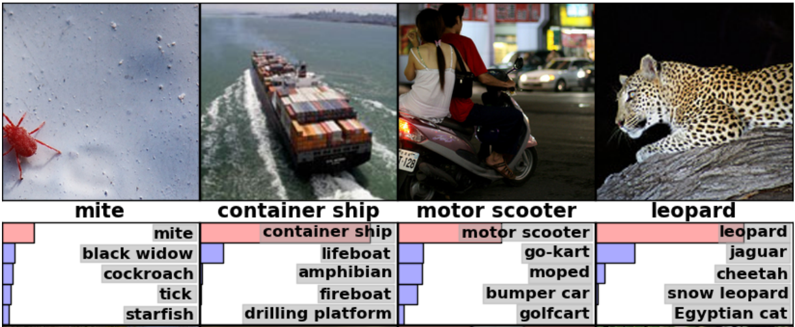

# 이미지 인식

우리의 뇌를 생각하면 시각적으로 인식하는 일은 쉬워 보인다. 
보통 사람이라면 사자와 재규어를 구별할 줄 알고 표지판을 읽을 수 있으며 
다른 사람의 얼굴 또한 어렵지 않게 인식할 수 있다. 
그러나 이는 이미지를 인식하는 뇌의 능력이 놀라울 정도로 뛰어나기 때문에 가능한 것이지 
이와 같은 일을 컴퓨터를 통해 해결하는 것은 매우 어려운 문제이다. 

지난 수 년간 기계학습 분야는 이미지 인식 문제에 대해 엄청난 진전을 이루어 냈다. 
특히 딥 러닝 기법의 하나인 [convolutional neural network](http://colah.github.io/posts/2014-07-Conv-Nets-Modular/)를 통해 
이미지 인식에 있어 혁신적 성과를 거두었는데 일부 분야에서는 사람의 인식 능력에 버금가거나 더 나은 결과를 보여주기도 했다.

연구자들은 학계에서 시작된 컴퓨터 비전 프로젝트 [ImageNet](http://www.image-net.org)에서 자신들의 작업을 검증해왔고,
그들의 연구는 [QuocNet], [AlexNet], [Inception (GoogLeNet)], [BN-Inception-v2]와 같은 최신식 모델을 만들어냈다.
구글 내외부 연구자 모두 이러한 모델을 설명하는 자료를 발표해 왔지만 자료가 널리 배포되는 것은 쉽지 않은 상황이다.
그래서 TensorFlow는 구글이 개발한 이미지 인식의 가장 최신 모델인 Inception-v3를 활용하는 코드를 공개한다.

[QuocNet]: http://static.googleusercontent.com/media/research.google.com/en//archive/unsupervised_icml2012.pdf
[AlexNet]: http://www.cs.toronto.edu/~fritz/absps/imagenet.pdf
[Inception (GoogLeNet)]: http://arxiv.org/abs/1409.4842
[BN-Inception-v2]: http://arxiv.org/abs/1502.03167
[Inception-v3]: http://arxiv.org/abs/1512.00567

Inception-v3는 [ImageNet]의 Large Visual Recognition Challenge에서 2012년 데이터를 사용하여 훈련된 모델이다. 
모든 이미지를 "얼룩말", "달마시안", "식기세척기"와 같은 [1000 classes]로 분류하는 것이 컴퓨터 비전의 표준 작업이다. 
다음의 예는 [AlexNet]이 몇 가지 사진을 분류한 결과이다:

<div style="width:50%; margin:auto; margin-bottom:10px; margin-top:20px;">

</div>

모델의 성능을 비교할 때는 "top-5 error rate"를 측정한다. 이는 모델이 가장 높은 확률로
예측한 5가지 예측이 정답이 아닌 빈도를 검토하는 것이다.
2012년 검증 데이터 세트에서 나타난 각 모델의 top-5 error rate는 [AlexNet]이 15.3%, [BN-Inception-v2]이 6.66%였고
[Inception-v3]는 3.46%를 달성했다.

> ImageNet 챌린지에서 사람이 도전한다면 성과가 어떠할까? Andrej Karpathy가 [blog post]에서 밝힌 바에 의하면 그의 top-5 error rate는 5.1%였다고 한다.

[ImageNet]: http://image-net.org/
[1000 classes]: http://image-net.org/challenges/LSVRC/2014/browse-synsets
[blog post]: http://karpathy.github.io/2014/09/02/what-i-learned-from-competing-against-a-convnet-on-imagenet/

본 튜토리얼은 [Inception-v3]를 사용하는 방법을 알려줄 것이다. 먼저 Python이나 C++로 본 모델을 사용해서 이미지를 [1000 classes]로 분류하는 방법을 배운다. 그리고 이 모델을 통해 다른 이미지 인식 문제에서 다시 활용될 수 있는 고수준의 특징을 추출하는 방법 또한 논의할 것이다. 

커뮤니티에서 이 모델을 어떤 모습으로 활용할지 기대되는 바이다.

##Python API로 사용하기

프로그램이 처음 실행될 때 `classify_image.py`는 `tensorflow.org`로 부터 훈련된 모델을 다운로드 받는다.
필요한 하드디스크의 여유 공간은 200메가바이트이다.

다음 명령어는 PIP패키지에서 TensorFlow를 설치한 이후, 터미널이 TensorFlow의 root 디렉토리로 설정되어 있는 상태를 전제로 한다.

    cd tensorflow/models/image/imagenet
    python classify_image.py

위 명령어는 다운로드로 제공된 판다 곰의 사진을 분류한다.

<div style="width:15%; margin:auto; margin-bottom:10px; margin-top:20px;">
  
</div>

만약 모델이 올바르게 작동한다면, 다음과 같은 내용이 출력된다:

    giant panda, panda, panda bear, coon bear, Ailuropoda melanoleuca (score = 0.88493)
    indri, indris, Indri indri, Indri brevicaudatus (score = 0.00878)
    lesser panda, red panda, panda, bear cat, cat bear, Ailurus fulgens (score = 0.00317)
    custard apple (score = 0.00149)
    earthstar (score = 0.00127)

다른 JPEG 이미지를 추가하려면 `--image_file` 인자를 수정하면 된다.

> 모델 데이터를 다른 디렉토리에 다운로드 받았다면, `--model_dir`를 다운로드 받은 디렉토리로 지정해야 한다.

## C++ API로 사용하기

C++의 production환경에서도 [Inception-v3] 모델을 사용할 수 있다.
모델을 정의하는 GraphDef를 담고 있는 아카이브를 다운로드 받는 방법은 아래와 같다:
(단, TensorFlow repository의 root 디렉토리에서 실행한다)

```bash
wget https://storage.googleapis.com/download.tensorflow.org/models/inception_dec_2015.zip -O tensorflow/examples/label_image/data/inception_dec_2015.zip

unzip tensorflow/examples/label_image/data/inception_dec_2015.zip -d tensorflow/examples/label_image/data/
```

다음으로 그래프를 불러오고 실행할 수 있는 코드를 담고 있는 C++ 바이너리를 컴파일 해야 한다.
만약 [the instructions to download the source installation of TensorFlow](../../get_started/os_setup.md#installing-from-sources)에 
나와 있는 지시사항을 자신의 플랫폼에 맞게 이행했다면, shell terminal에서 다음과 같은 명령어를 실행하여 예제를 빌드할 수 있다:

```bash
bazel build tensorflow/examples/label_image/...
```

위 명령어가 입력되면 실행 가능한 바이너리 파일이 생성될 것이고 아래 명령어를 통해 실행할 수 있다:

```bash
bazel-bin/tensorflow/examples/label_image/label_image
```

이것은 프레임워크가 함께 전달되는 기본(default) 예제 이미지를 사용하며 아래와 유사한 내용이 출력된다:

```
I tensorflow/examples/label_image/main.cc:200] military uniform (866): 0.647296
I tensorflow/examples/label_image/main.cc:200] suit (794): 0.0477196
I tensorflow/examples/label_image/main.cc:200] academic gown (896): 0.0232411
I tensorflow/examples/label_image/main.cc:200] bow tie (817): 0.0157356
I tensorflow/examples/label_image/main.cc:200] bolo tie (940): 0.0145024
```

이러한 경우 [Admiral Grace Hopper](https://en.wikipedia.org/wiki/Grace_Hopper)의 기본(default) 이미지를 사용하고 있는 것이며,
0.6점이라는 높은 점수로 네트워크가 군복을 입고 있는 여성을 식별하고 있음을 확인할 수 있다.


<div style="width:45%; margin:auto; margin-bottom:10px; margin-top:20px;">
  
</div>

다음으로 --image= 인자를 추가하여 본인이 갖고 있는 이미지로 테스트해 본다. 예를 들면 다음과 같다:

```bash
bazel-bin/tensorflow/examples/label_image/label_image --image=my_image.png
```

`tensorflow/examples/label_image/main.cc`](https://github.com/tensorflow/tensorflow/blob/master/tensorflow/examples/label_image/main.cc)파일을 살펴보면 어떻게 작동하는지 알 수 있다. 
이 코드를 통해 TensorFlow 라이브러리를 사용자의 애플리케이션에 사용하는 데 도움이 되길 바라며 주요 함수들을 차례차례 살펴볼 것이다.

The command line flags control where the files are loaded from, and properties of the input images.
The model expects to get square 299x299 RGB images, so those are the `input_width`
and `input_height` flags. We also need to scale the pixel values from integers that
are between 0 and 255 to the floating point values that the graph operates on.
We control the scaling with the `input_mean` and `input_std` flags: we first subtract
`input_mean` from each pixel value, then divide it by `input_std`.
커맨드 라인 플래그(command line flags)는 파일을 불러온 위치와 입력된 이미지의 속성을 조정하는 기능을 한다.
모델은 정사각형 299x299 사이즈의 RGB 이미지를 취급하기 때문에 이를 `input_width`와  `input_height` 플래그라고 한다.
그리고 픽셀 값을 0과 255사이의 정수에서 그래프를 사용하기 위한 부동 소수점으로 크기 조정(scaling)해야 한다.
크기 조정은 `input_mean`과 `input_std` 플래그로 조절한다. 각 픽셀 값에서 `input_mean`을 빼고 난 후 `input_std`로 나눈다.

These values probably look somewhat magical, but they are just defined by the 
original model author based on what he/she wanted to use as input images for 
training. If you have a graph that you've trained yourself, you'll just need
to adjust the values to match whatever you used during your training process.
이러한 값들이 신기해 보일 수 있는데, 이는 모델을 만든 원작자가 훈련용 입력 이미지로서 사용하고 싶은 것을 정의한 내용일 뿐이다.
사용자가 스스로 훈련시킨 그래프가 있다면, 자신의 훈련 프로세스에 적합하도록 사용자가 원하는 값으로 조정하면 된다.


You can see how they're applied to an image in the [`ReadTensorFromImageFile()`]
(https://github.com/tensorflow/tensorflow/blob/master/tensorflow/examples/label_image/main.cc#L88)
function.
이러한 값들이 [`ReadTensorFromImageFile()`]
(https://github.com/tensorflow/tensorflow/blob/master/tensorflow/examples/label_image/main.cc#L88)의 함수를 통해 이미지에 어떻게 적용되는지 확인할 수 있다.

```C++
// Given an image file name, read in the data, try to decode it as an image,
// resize it to the requested size, and then scale the values as desired.
Status ReadTensorFromImageFile(string file_name, const int input_height,
                               const int input_width, const float input_mean,
                               const float input_std,
                               std::vector<Tensor>* out_tensors) {
  tensorflow::GraphDefBuilder b;
```
We start by creating a `GraphDefBuilder`, which is an object we can use to
specify a model to run or load.
가장 먼저 실행하거나 불러올 모델을 설정하기 위해 `GraphDefBuilder`를 만든다.

```C++
  string input_name = "file_reader";
  string output_name = "normalized";
  tensorflow::Node* file_reader =
      tensorflow::ops::ReadFile(tensorflow::ops::Const(file_name, b.opts()),
                                b.opts().WithName(input_name));
```
We then start creating nodes for the small model we want to run
to load, resize, and scale the pixel values to get the result the main model
expects as its input. The first node we create is just a `Const` op that holds a
tensor with the file name of the image we want to load. That's then passed as the
first input to the `ReadFile` op. You might notice we're passing `b.opts()` as the last
argument to all the op creation functions. The argument ensures that the node is added to
the model definition held in the `GraphDefBuilder`. We also name the `ReadFile`
operator by making the `WithName()` call to `b.opts()`. This gives a name to the node,
which isn't strictly necessary since an automatic name will be assigned if you don't
do this, but it does make debugging a bit easier.
그 다음에 실행할 소형 모델의 노드를 생성한다. 이는 픽셀 값을 불러오고, 변경하고, 크기 조정하는 데 사용되며 메인 모델의 입력값으로 쓰일 것이다.
첫 번째로 만든 노드는 `Const` op(short for operations, meaning node in the graph)이며 이는 우리가 불러 올 이미지의 파일 이름이 담긴 텐서를 갖고 있다. 
이것은 `ReadFile` op에게 첫 번째 입력값으로 전달된다. op를 생성하는 모든 함수의 마지막 인자로 `b.opts()`를 전달할 것임을 알 수 있을 것이다.
인자는 해당 노드가 `GraphDefBuilder`가 담고 있는 모델 정의에 반드시 추가되도록 한다. 
또한 `WithName()` 함수를 `b.opts()`에게 호출하여 `ReadFile` 연산자를 지정할 것이다. 이것은 노드의 이름을 지정하는 것인데, 사실 사용자가 따로 수행하지 않더라도 자동 이름이 생성되어 할당되므로 필수적인 과정은 아니다. 하지만 디버깅에 도움이 되는 과정이다.

```C++
  // Now try to figure out what kind of file it is and decode it.
  const int wanted_channels = 3;
  tensorflow::Node* image_reader;
  if (tensorflow::StringPiece(file_name).ends_with(".png")) {
    image_reader = tensorflow::ops::DecodePng(
        file_reader,
        b.opts().WithAttr("channels", wanted_channels).WithName("png_reader"));
  } else {
    // Assume if it's not a PNG then it must be a JPEG.
    image_reader = tensorflow::ops::DecodeJpeg(
        file_reader,
        b.opts().WithAttr("channels", wanted_channels).WithName("jpeg_reader"));
  }
  // Now cast the image data to float so we can do normal math on it.
  tensorflow::Node* float_caster = tensorflow::ops::Cast(
      image_reader, tensorflow::DT_FLOAT, b.opts().WithName("float_caster"));
  // The convention for image ops in TensorFlow is that all images are expected
  // to be in batches, so that they're four-dimensional arrays with indices of
  // [batch, height, width, channel]. Because we only have a single image, we
  // have to add a batch dimension of 1 to the start with ExpandDims().
  tensorflow::Node* dims_expander = tensorflow::ops::ExpandDims(
      float_caster, tensorflow::ops::Const(0, b.opts()), b.opts());
  // Bilinearly resize the image to fit the required dimensions.
  tensorflow::Node* resized = tensorflow::ops::ResizeBilinear(
      dims_expander, tensorflow::ops::Const({input_height, input_width},
                                            b.opts().WithName("size")),
      b.opts());
  // Subtract the mean and divide by the scale.
  tensorflow::ops::Div(
      tensorflow::ops::Sub(
          resized, tensorflow::ops::Const({input_mean}, b.opts()), b.opts()),
      tensorflow::ops::Const({input_std}, b.opts()),
      b.opts().WithName(output_name));
```
We then keep adding more nodes, to decode the file data as an image, to cast the
integers into floating point values, to resize it, and then finally to run the
subtraction and division operations on the pixel values.
그리고 나서 계속해서 노드를 추가한다. 이는 파일 데이터를 이미지로 디코드하고, 정수값을 부동소수점 값으로 바꾸고, 
값을 다시 조절하고, 마지막으로 픽셀값을 빼고 나누는 연산 과정을 거치려고 하는 것이다.

```C++
  // This runs the GraphDef network definition that we've just constructed, and
  // returns the results in the output tensor.
  tensorflow::GraphDef graph;
  TF_RETURN_IF_ERROR(b.ToGraphDef(&graph));
```
At the end of this we have
a model definition stored in the b variable, which we turn into a full graph
definition with the `ToGraphDef()` function.
위와 같은 과정을 거치면 최종적으로 변수 b에 담긴 모델 정의를 갖게 된다. 변수 b는 `ToGraphDef()` 함수를 통해 완전한 그래프로 변환될 수 있다.

```C++
  std::unique_ptr<tensorflow::Session> session(
      tensorflow::NewSession(tensorflow::SessionOptions()));
  TF_RETURN_IF_ERROR(session->Create(graph));
  TF_RETURN_IF_ERROR(session->Run({}, {output_name}, {}, out_tensors));
  return Status::OK();
```
Then we create a [`Session`](http://www.tensorflow.org/versions/master/api_docs/cc/ClassSession.html#class-tensorflow-session) 
object, which is the interface to actually running the graph, and run it, 
specifying which node we want to get the output from, and where to put the
output data.
그 다음으로 [`Session`](http://www.tensorflow.org/versions/master/api_docs/cc/ClassSession.html#class-tensorflow-session) 오브젝트를 생성한다.
이는 그래프를 표시하는 인터페이스 오브젝트이다. 이것을 실행하여 어떤 노드로부터 출력을 얻을 것인지, 출력된 데이터를 어디에 둘지 구체화한다.

This gives us a vector of `Tensor` objects, which in this case we know will only be a
single object long. You can think of a `Tensor` as a multi-dimensional array in this
context, and it holds a 299 pixel high, 299 pixel width, 3 channel image as float
values. If you have your own image-processing framework in your product already, you
should be able to use that instead, as long as you apply the same transformations
before you feed images into the main graph.

This is a simple example of creating a small TensorFlow graph dynamically in C++,
but for the pre-trained Inception model we want to load a much larger definition from
a file. You can see how we do that in the `LoadGraph()` function.

```C++
// Reads a model graph definition from disk, and creates a session object you
// can use to run it.
Status LoadGraph(string graph_file_name,
                 std::unique_ptr<tensorflow::Session>* session) {
  tensorflow::GraphDef graph_def;
  Status load_graph_status =
      ReadBinaryProto(tensorflow::Env::Default(), graph_file_name, &graph_def);
  if (!load_graph_status.ok()) {
    return tensorflow::errors::NotFound("Failed to load compute graph at '",
                                        graph_file_name, "'");
  }
```
If you've looked through the image loading code, a lot of the terms should seem familiar. Rather than
using a `GraphDefBuilder` to produce a `GraphDef` object, we load a protobuf file that
directly contains the `GraphDef`.

```C++
  session->reset(tensorflow::NewSession(tensorflow::SessionOptions()));
  Status session_create_status = (*session)->Create(graph_def);
  if (!session_create_status.ok()) {
    return session_create_status;
  }
  return Status::OK();
}
```
Then we create a Session object from that `GraphDef` and
pass it back to the caller so that they can run it at a later time.

The `GetTopLabels()` function is a lot like the image loading, except that in this case
we want to take the results of running the main graph, and turn it into a sorted list
of the highest-scoring labels. Just like the image loader, it creates a
`GraphDefBuilder`, adds a couple of nodes to it, and then runs the short graph to get a
pair of output tensors. In this case they represent the sorted scores and index
positions of the highest results.

```C++
// Analyzes the output of the Inception graph to retrieve the highest scores and
// their positions in the tensor, which correspond to categories.
Status GetTopLabels(const std::vector<Tensor>& outputs, int how_many_labels,
                    Tensor* indices, Tensor* scores) {
  tensorflow::GraphDefBuilder b;
  string output_name = "top_k";
  tensorflow::ops::TopK(tensorflow::ops::Const(outputs[0], b.opts()),
                        how_many_labels, b.opts().WithName(output_name));
  // This runs the GraphDef network definition that we've just constructed, and
  // returns the results in the output tensors.
  tensorflow::GraphDef graph;
  TF_RETURN_IF_ERROR(b.ToGraphDef(&graph));
  std::unique_ptr<tensorflow::Session> session(
      tensorflow::NewSession(tensorflow::SessionOptions()));
  TF_RETURN_IF_ERROR(session->Create(graph));
  // The TopK node returns two outputs, the scores and their original indices,
  // so we have to append :0 and :1 to specify them both.
  std::vector<Tensor> out_tensors;
  TF_RETURN_IF_ERROR(session->Run({}, {output_name + ":0", output_name + ":1"},
                                  {}, &out_tensors));
  *scores = out_tensors[0];
  *indices = out_tensors[1];
  return Status::OK();
```
The `PrintTopLabels()` function takes those sorted results, and prints them out in a
friendly way. The `CheckTopLabel()` function is very similar, but just makes sure that
the top label is the one we expect, for debugging purposes.

At the end, [`main()`](https://github.com/tensorflow/tensorflow/blob/master/tensorflow/examples/label_image/main.cc#L252)
ties together all of these calls.

```C++
int main(int argc, char* argv[]) {
  // We need to call this to set up global state for TensorFlow.
  tensorflow::port::InitMain(argv[0], &argc, &argv);
  Status s = tensorflow::ParseCommandLineFlags(&argc, argv);
  if (!s.ok()) {
    LOG(ERROR) << "Error parsing command line flags: " << s.ToString();
    return -1;
  }

  // First we load and initialize the model.
  std::unique_ptr<tensorflow::Session> session;
  string graph_path = tensorflow::io::JoinPath(FLAGS_root_dir, FLAGS_graph);
  Status load_graph_status = LoadGraph(graph_path, &session);
  if (!load_graph_status.ok()) {
    LOG(ERROR) << load_graph_status;
    return -1;
  }
```
We load the main graph.

```C++
  // Get the image from disk as a float array of numbers, resized and normalized
  // to the specifications the main graph expects.
  std::vector<Tensor> resized_tensors;
  string image_path = tensorflow::io::JoinPath(FLAGS_root_dir, FLAGS_image);
  Status read_tensor_status = ReadTensorFromImageFile(
      image_path, FLAGS_input_height, FLAGS_input_width, FLAGS_input_mean,
      FLAGS_input_std, &resized_tensors);
  if (!read_tensor_status.ok()) {
    LOG(ERROR) << read_tensor_status;
    return -1;
  }
  const Tensor& resized_tensor = resized_tensors[0];
```
Load, resize, and process the input image.

```C++
  // Actually run the image through the model.
  std::vector<Tensor> outputs;
  Status run_status = session->Run({{FLAGS_input_layer, resized_tensor}},
                                   {FLAGS_output_layer}, {}, &outputs);
  if (!run_status.ok()) {
    LOG(ERROR) << "Running model failed: " << run_status;
    return -1;
  }
```
Here we run the loaded graph with the image as an input.

```C++
  // This is for automated testing to make sure we get the expected result with
  // the default settings. We know that label 866 (military uniform) should be
  // the top label for the Admiral Hopper image.
  if (FLAGS_self_test) {
    bool expected_matches;
    Status check_status = CheckTopLabel(outputs, 866, &expected_matches);
    if (!check_status.ok()) {
      LOG(ERROR) << "Running check failed: " << check_status;
      return -1;
    }
    if (!expected_matches) {
      LOG(ERROR) << "Self-test failed!";
      return -1;
    }
  }
```
For testing purposes we can check to make sure we get the output we expect here.

```C++
  // Do something interesting with the results we've generated.
  Status print_status = PrintTopLabels(outputs, FLAGS_labels);
```
Finally we print the labels we found.

```C++
  if (!print_status.ok()) {
    LOG(ERROR) << "Running print failed: " << print_status;
    return -1;
  }
```

The error handling here is using TensorFlow's `Status`
object, which is very convenient because it lets you know whether any error has
occurred with the `ok()` checker, and then can be printed out to give a readable error
message.

In this case we are demonstrating object recognition, but you should be able to
use very similar code on other models you've found or trained yourself, across
all
sorts of domains. We hope this small example gives you some ideas on how to use
TensorFlow within your own products.

> **EXERCISE**: Transfer learning is the idea that, if you know how to solve a task well, you
should be able to transfer some of that understanding to solving related
problems.  One way to perform transfer learning is to remove the final
classification layer of the network and extract 
the [next-to-last layer of the CNN](http://arxiv.org/abs/1310.1531), in this case a 2048 dimensional vector.
There's a guide to doing this [in the how-to section](../../how_tos/image_retraining/index.html).


## Resources for Learning More

To learn about neural networks in general, Michael Nielsen's
[free online book](http://neuralnetworksanddeeplearning.com/chap1.html)
is an excellent resource. For convolutional neural networks in particular,
Chris Olah has some
[nice blog posts](http://colah.github.io/posts/2014-07-Conv-Nets-Modular/),
and Michael Nielsen's book has a
[great chapter](http://neuralnetworksanddeeplearning.com/chap6.html)
covering them.

To find out more about implementing convolutional neural networks, you can jump to
the TensorFlow [deep convolutional networks tutorial](http://www.tensorflow.org/tutorials/deep_cnn/index.html),
or start a bit more gently with our
[ML beginner](http://www.tensorflow.org/tutorials/mnist/beginners/index.html)
or [ML expert](http://www.tensorflow.org/tutorials/mnist/pros/index.html)
MNIST starter tutorials. Finally, if you want to get up to speed on research
in this area, you can
read the recent work of all the papers referenced in this tutorial.

